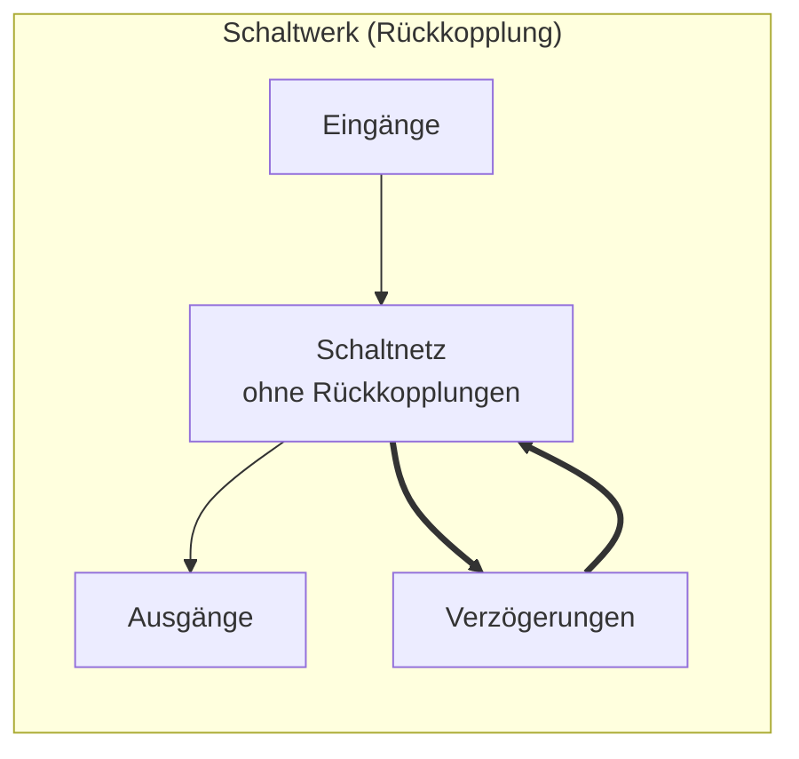

# Automatisierte Verarbeitung

```mermaid
graph LR
    subgraph Schaltwerk ["Schaltwerk (Rückkopplung)"]
        In2["Eingänge"] --> Net["Schaltnetz<br>ohne Rückkopplungen"] --> Out2["Ausgänge"]
        Net ==> Delay["Verzögerungen"] ==> Net
    end
```
- Schaltwerk mit *Ein-* und *Ausgabedaten* formalisieren.
- Eingabedaten und Ausgabedaten sind *Nachrichten* => Alphabet Sequenz.